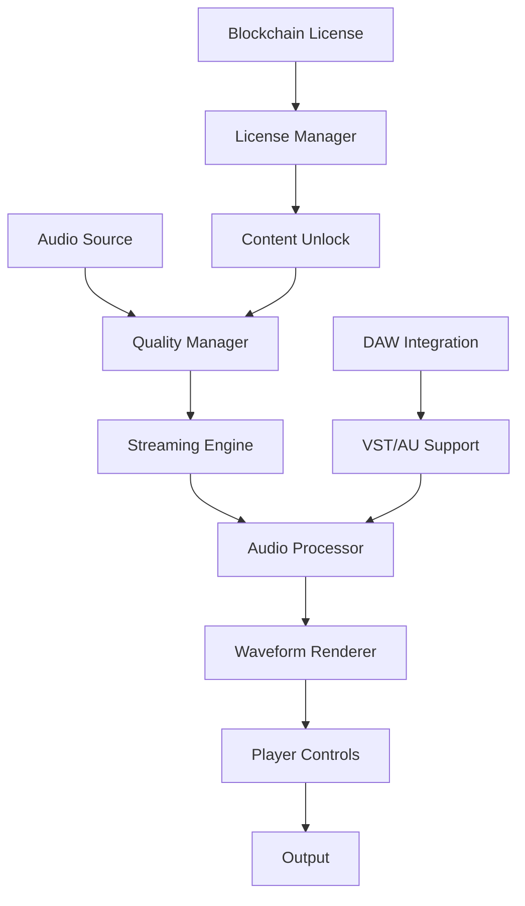

# Audio Player System Architecture

**🔴 CRITICAL** - Complete audio player architecture for web, mobile, and desktop platforms.

---

## 🎯 **OVERVIEW**

GotMusic's audio player system is a **multi-platform, professional-grade audio processing pipeline** designed to compete with industry leaders like Spotify, Apple Music, and professional DAW software.

### **Platform Support**
- **🌐 Web**: Enhanced TypeScript/React with Web Audio API
- **📱 Mobile**: React Native + Expo Audio with native performance
- **🖥️ Desktop**: JUCE C++ standalone with DAW integration

---

## 🏗️ **SYSTEM ARCHITECTURE**

### **Core Components**



### **Quality Tiers**

| Tier | Bitrate | Format | Use Case | Platform |
|------|---------|--------|----------|----------|
| 🔴 **Preview** | 128 kbps | AAC | 30s previews | All |
| 🟠 **Streaming** | 96-320 kbps | AAC | Full playback | Web/Mobile |
| 🟡 **Download** | Lossless | FLAC | Licensed content | Desktop |
| 🟢 **Master** | 24-bit/48kHz | WAV/AIFF | Studio quality | Desktop |

---

## 🎵 **AUDIO PROCESSING PIPELINE**

### **1. Input Processing**
- **Format Detection**: Auto-detect WAV, AIFF, FLAC, MP3, AAC
- **Quality Analysis**: LUFS measurement, dynamic range analysis
- **Metadata Extraction**: BPM, key, genre, artist, title

### **2. Quality Management**
- **LUFS Normalization**: Spotify-standard -14 LUFS
- **Adaptive Streaming**: Network-based quality adjustment
- **Format Conversion**: Real-time transcoding for different platforms

### **3. Audio Processing**
- **EQ Processing**: Professional 3-band EQ with presets
- **Compression**: Dynamic range control
- **Limiting**: Peak limiting for consistent levels
- **Spatial Processing**: Stereo width, panning, 3D positioning

### **4. Output Processing**
- **Dithering**: High-quality dithering for bit-depth reduction
- **Oversampling**: Anti-aliasing for clean output
- **Latency Compensation**: Real-time latency adjustment

---

## 🖥️ **DESKTOP STANDALONE FEATURES**

### **JUCE C++ Architecture**
```cpp
class GotMusicPlayer : public juce::AudioAppComponent {
private:
    // Audio Processing
    juce::AudioFormatManager formatManager;
    juce::AudioTransportSource transportSource;
    juce::AudioProcessorGraph processorGraph;
    
    // Quality & Streaming
    AudioQualityManager qualityManager;
    StreamingEngine streamingEngine;
    WaveformRenderer waveformRenderer;
    
    // Blockchain Integration
    BlockchainLicenseManager licenseManager;
    AssetManager assetManager;
    
    // DAW Integration
    VSTPluginManager vstManager;
    DAWIntegrationEngine dawEngine;
};
```

### **DAW Integration**
- **VST3/AU Plugin Support**: Load external plugins
- **Real-time Processing**: Zero-latency audio processing
- **MIDI Support**: Full MIDI input/output
- **Transport Sync**: Sync with host DAW
- **Project Export**: Export to DAW projects

### **Professional Features**
- **Advanced EQ**: 10-band parametric EQ
- **Spatial Audio**: 3D positioning and movement
- **Motion System**: Brauer-style autopan
- **Delay System**: Professional delay with modulation
- **Reverb Engine**: Room/Plate/Hall algorithms

---

## 🌐 **WEB ENHANCEMENTS**

### **Current State Analysis**
- **Basic HTML5 Audio**: Limited functionality
- **No Waveform Visualization**: Missing key feature
- **Basic Quality Control**: No LUFS normalization
- **Limited Streaming**: Basic HTTP streaming

### **Enhanced Web Player**
```typescript
interface EnhancedWebPlayer {
  // Waveform Visualization
  waveformRenderer: WaveformRenderer;
  
  // Quality Control
  qualityManager: AudioQualityManager;
  lufsNormalizer: LUFSNormalizer;
  
  // Streaming
  adaptiveStreaming: AdaptiveStreamingEngine;
  cdnIntegration: CDNIntegration;
  
  // Professional Features
  eqProcessor: EQProcessor;
  spatialProcessor: SpatialProcessor;
  motionEngine: MotionEngine;
}
```

### **Web Audio API Integration**
- **AudioContext**: High-performance audio processing
- **WebGL**: Hardware-accelerated waveform rendering
- **Web Workers**: Background audio processing
- **Service Workers**: Offline audio caching

---

## 📱 **MOBILE ENHANCEMENTS**

### **React Native + Expo Audio**
```typescript
interface MobileAudioPlayer {
  // Native Performance
  expoAudio: ExpoAudio;
  nativeAudio: NativeAudioModule;
  
  // Quality Control
  qualityManager: MobileQualityManager;
  streamingEngine: MobileStreamingEngine;
  
  // Professional Features
  eqProcessor: MobileEQProcessor;
  spatialProcessor: MobileSpatialProcessor;
}
```

### **Mobile-Specific Features**
- **Audio Session Management**: iOS/Android audio session control
- **Background Playback**: Continue playing when app is backgrounded
- **Headphone Detection**: Auto-pause when headphones disconnected
- **Battery Optimization**: Efficient audio processing

---

## 🔗 **BLOCKCHAIN INTEGRATION**

### **License Management**
```typescript
interface BlockchainLicenseManager {
  // License Verification
  verifyLicense: (txHash: string) => Promise<boolean>;
  checkOwnership: (walletAddress: string) => Promise<boolean>;
  
  // Content Unlock
  unlockContent: (assetId: string) => Promise<void>;
  lockContent: (assetId: string) => Promise<void>;
  
  // Apple Compliance
  compliantUnlock: (license: License) => Promise<void>;
}
```

### **Apple Policy Compliance**
- **✅ Allowed**: Blockchain verification, content unlock
- **❌ Avoided**: Payment processing, currency conversion
- **🔒 Secure**: External wallet integration only

---

## 🎨 **WAVEFORM VISUALIZATION**

### **Web Implementation**
```typescript
class WebWaveformRenderer {
  private canvas: HTMLCanvasElement;
  private webgl: WebGLRenderingContext;
  
  async generateWaveform(audioBuffer: AudioBuffer): Promise<WaveformData> {
    const samples = this.downsample(audioBuffer.getChannelData(0));
    return this.renderToWebGL(samples);
  }
}
```

### **Desktop Implementation**
```cpp
class DesktopWaveformRenderer : public juce::Component {
public:
    void paint(juce::Graphics& g) override {
        // High-performance waveform rendering
        g.setColour(juce::Colours::brandPrimary);
        g.drawLine(0, height/2, width, height/2);
    }
    
    void setAudioBuffer(const juce::AudioBuffer<float>& buffer) {
        waveformData = generateWaveformData(buffer);
        repaint();
    }
};
```

---

## 🚀 **IMPLEMENTATION ROADMAP**

### **Phase 1: Enhanced Web Player (2-3 weeks)**
- [ ] Waveform Visualization (Canvas/WebGL)
- [ ] LUFS Normalization (Web Audio API)
- [ ] Quality Settings (128k/256k/320k)
- [ ] Adaptive Streaming (Network-based)

### **Phase 2: Desktop Standalone (4-6 weeks)**
- [ ] JUCE Framework Setup
- [ ] Basic Player (Play/pause/seek)
- [ ] Waveform Rendering (High-performance)
- [ ] Audio Quality Pipeline

### **Phase 3: DAW Integration (6-8 weeks)**
- [ ] VST/AU Plugin Development
- [ ] Real-time Audio Processing
- [ ] Blockchain License Verification
- [ ] Professional Audio Features

### **Phase 4: Advanced Features (8-12 weeks)**
- [ ] Advanced EQ/Effects
- [ ] Multi-track Support
- [ ] Cloud Sync
- [ ] Professional Mastering Tools

---

## 📊 **PERFORMANCE TARGETS**

### **Latency Requirements**
- **Web**: < 100ms (network dependent)
- **Mobile**: < 50ms (native processing)
- **Desktop**: < 10ms (real-time processing)

### **Quality Standards**
- **Preview**: 128 kbps AAC, -14 LUFS
- **Streaming**: 96-320 kbps AAC, -14 LUFS
- **Download**: FLAC 24-bit/48kHz, -14 LUFS
- **Master**: WAV 24-bit/48kHz, -14 LUFS

### **Compatibility**
- **Web**: Chrome 90+, Firefox 88+, Safari 14+
- **Mobile**: iOS 14+, Android 8+
- **Desktop**: Windows 10+, macOS 10.15+, Linux Ubuntu 20+

---

## 🔧 **TECHNICAL SPECIFICATIONS**

### **Audio Formats**
- **Input**: WAV, AIFF, FLAC, MP3, AAC, OGG
- **Processing**: 32-bit float, 48kHz
- **Output**: AAC (streaming), FLAC (download), WAV (master)

### **Streaming Protocols**
- **HTTP/2**: Efficient streaming
- **WebRTC**: Real-time communication
- **WebSocket**: Live updates
- **CDN**: Global edge caching

### **Security**
- **DRM**: Blockchain-based license verification
- **Encryption**: AES-256 for content protection
- **Authentication**: JWT tokens with refresh
- **Privacy**: No personal data collection

---

## 🎯 **SUCCESS METRICS**

### **Performance Metrics**
- **Load Time**: < 2s for preview, < 5s for full track
- **CPU Usage**: < 5% on desktop, < 10% on mobile
- **Memory Usage**: < 100MB on desktop, < 50MB on mobile
- **Battery Life**: < 5% per hour on mobile

### **Quality Metrics**
- **Audio Quality**: Professional studio standards
- **Visual Quality**: 60fps waveform rendering
- **User Experience**: Intuitive, responsive interface
- **Accessibility**: Full keyboard navigation, screen reader support

---

**Last Updated:** 2025-10-23  
**Status:** 🔴 **CRITICAL** - Core architecture document  
**Next Steps:** Begin Phase 1 implementation (Enhanced Web Player)

---

*This document serves as the single source of truth for GotMusic's audio player system architecture.*
