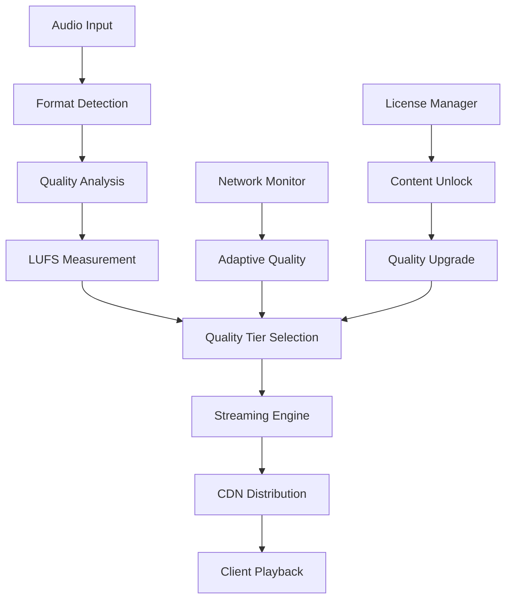

# Audio Quality Pipeline Architecture

**🟠 HIGH** - Professional audio quality management and streaming pipeline for all platforms.

---

## 🎯 **OVERVIEW**

The Audio Quality Pipeline is the **core system** responsible for managing audio quality, streaming, and processing across all GotMusic platforms. It ensures consistent, professional-grade audio quality while optimizing for different network conditions and device capabilities.

### **Key Features**
- **🎵 LUFS Normalization**: Spotify-standard loudness normalization
- **📊 Adaptive Streaming**: Network-based quality adjustment
- **🔄 Real-time Processing**: Live audio quality optimization
- **🌐 Multi-Platform**: Web, mobile, and desktop support

---

## 🏗️ **PIPELINE ARCHITECTURE**

### **Quality Management System**



### **Quality Tiers**

| Tier | Bitrate | Format | LUFS | Use Case | Platform |
|------|---------|--------|------|----------|----------|
| 🔴 **Preview** | 128 kbps | AAC | -14 | 30s previews | All |
| 🟠 **Streaming** | 96-320 kbps | AAC | -14 | Full playback | Web/Mobile |
| 🟡 **Download** | Lossless | FLAC | -14 | Licensed content | Desktop |
| 🟢 **Master** | 24-bit/48kHz | WAV | -14 | Studio quality | Desktop |

---

## 🎵 **LUFS NORMALIZATION**

### **Spotify-Standard Implementation**

```typescript
// LUFS Normalization Engine
class LUFSNormalizer {
  private targetLUFS = -14.0; // Spotify standard
  private analysisWindow = 400; // ms
  private smoothingTime = 100; // ms
  
  public normalizeLoudness(audioBuffer: Float32Array): Float32Array {
    // 1. Analyze current LUFS
    const currentLUFS = this.analyzeLUFS(audioBuffer);
    
    // 2. Calculate gain adjustment
    const gainAdjustment = this.targetLUFS - currentLUFS;
    
    // 3. Apply gain with smoothing
    return this.applyGainWithSmoothing(audioBuffer, gainAdjustment);
  }
  
  private analyzeLUFS(buffer: Float32Array): number {
    // K-weighting filter
    const kWeighted = this.applyKWeighting(buffer);
    
    // RMS calculation
    const rms = this.calculateRMS(kWeighted);
    
    // LUFS conversion
    return this.rmsToLUFS(rms);
  }
  
  private applyKWeighting(buffer: Float32Array): Float32Array {
    // K-weighting filter implementation
    // High-pass at 4 Hz, low-pass at 22 kHz
    // Pre-emphasis curve
    return this.processKWeighting(buffer);
  }
}
```

### **Real-time LUFS Processing**

```cpp
// C++ Implementation for Desktop
class LUFSNormalizer {
private:
    static constexpr float TARGET_LUFS = -14.0f;
    static constexpr int ANALYSIS_WINDOW = 400; // ms
    static constexpr int SMOOTHING_TIME = 100;  // ms
    
    // K-weighting filter
    juce::dsp::IIR::Filter<float> kWeightingFilter;
    
    // Gain smoothing
    juce::dsp::Gain<float> gainProcessor;
    juce::dsp::Gain<float> smoothingProcessor;
    
public:
    void processAudioBlock(juce::AudioBuffer<float>& buffer) {
        // Analyze current LUFS
        float currentLUFS = analyzeLUFS(buffer);
        
        // Calculate gain adjustment
        float gainAdjustment = TARGET_LUFS - currentLUFS;
        
        // Apply gain with smoothing
        applyGainWithSmoothing(buffer, gainAdjustment);
    }
    
private:
    float analyzeLUFS(const juce::AudioBuffer<float>& buffer) {
        // K-weighting filter
        juce::AudioBuffer<float> kWeighted = buffer;
        kWeightingFilter.process(juce::dsp::ProcessContextReplacing<float>(kWeighted));
        
        // RMS calculation
        float rms = calculateRMS(kWeighted);
        
        // LUFS conversion
        return rmsToLUFS(rms);
    }
};
```

---

## 📊 **ADAPTIVE STREAMING**

### **Network-Based Quality Adjustment**

```typescript
// Adaptive Streaming Engine
class AdaptiveStreamingEngine {
  private qualityLevels = {
    low: { bitrate: 96, format: 'aac' },
    normal: { bitrate: 160, format: 'aac' },
    high: { bitrate: 256, format: 'aac' },
    veryHigh: { bitrate: 320, format: 'aac' }
  };
  
  private currentQuality: QualityLevel = 'normal';
  private networkMonitor: NetworkMonitor;
  
  public async adjustQuality(): Promise<void> {
    const networkCondition = await this.networkMonitor.getCondition();
    
    switch (networkCondition) {
      case 'excellent':
        this.currentQuality = 'veryHigh';
        break;
      case 'good':
        this.currentQuality = 'high';
        break;
      case 'fair':
        this.currentQuality = 'normal';
        break;
      case 'poor':
        this.currentQuality = 'low';
        break;
    }
    
    await this.switchQuality(this.currentQuality);
  }
  
  private async switchQuality(quality: QualityLevel): Promise<void> {
    const qualityConfig = this.qualityLevels[quality];
    
    // Seamless quality switch
    await this.streamingEngine.switchBitrate(qualityConfig.bitrate);
    await this.streamingEngine.switchFormat(qualityConfig.format);
  }
}
```

### **Network Monitoring**

```typescript
// Network Condition Monitor
class NetworkMonitor {
  private metrics: NetworkMetrics = {
    bandwidth: 0,
    latency: 0,
    packetLoss: 0,
    jitter: 0
  };
  
  public async getCondition(): Promise<NetworkCondition> {
    await this.updateMetrics();
    
    if (this.metrics.bandwidth > 1000 && this.metrics.latency < 50) {
      return 'excellent';
    } else if (this.metrics.bandwidth > 500 && this.metrics.latency < 100) {
      return 'good';
    } else if (this.metrics.bandwidth > 200 && this.metrics.latency < 200) {
      return 'fair';
    } else {
      return 'poor';
    }
  }
  
  private async updateMetrics(): Promise<void> {
    // Bandwidth test
    this.metrics.bandwidth = await this.measureBandwidth();
    
    // Latency test
    this.metrics.latency = await this.measureLatency();
    
    // Packet loss test
    this.metrics.packetLoss = await this.measurePacketLoss();
    
    // Jitter test
    this.metrics.jitter = await this.measureJitter();
  }
}
```

---

## 🔄 **REAL-TIME PROCESSING**

### **Audio Quality Optimization**

```typescript
// Real-time Audio Processor
class AudioQualityProcessor {
  private processors: AudioProcessor[] = [
    new LUFSNormalizer(),
    new EQProcessor(),
    new Compressor(),
    new Limiter(),
    new DitheringProcessor()
  ];
  
  public processAudioBlock(audioBuffer: Float32Array): Float32Array {
    let processedBuffer = audioBuffer;
    
    // Apply processing chain
    for (const processor of this.processors) {
      processedBuffer = processor.process(processedBuffer);
    }
    
    return processedBuffer;
  }
  
  public setQualitySettings(settings: QualitySettings): void {
    this.lufsNormalizer.setTargetLUFS(settings.targetLUFS);
    this.eqProcessor.setEQSettings(settings.eqSettings);
    this.compressor.setCompressionSettings(settings.compressionSettings);
    this.limiter.setLimitingSettings(settings.limitingSettings);
  }
}
```

### **Quality Settings Interface**

```typescript
interface QualitySettings {
  // LUFS Normalization
  targetLUFS: number; // -14.0 for Spotify standard
  
  // EQ Settings
  eqSettings: {
    enabled: boolean;
    bands: EQBand[];
  };
  
  // Compression Settings
  compressionSettings: {
    enabled: boolean;
    threshold: number; // dB
    ratio: number; // 1:1 to 20:1
    attack: number; // ms
    release: number; // ms
  };
  
  // Limiting Settings
  limitingSettings: {
    enabled: boolean;
    ceiling: number; // dB
    release: number; // ms
  };
  
  // Dithering Settings
  ditheringSettings: {
    enabled: boolean;
    type: 'none' | 'rectangular' | 'triangular' | 'shaped';
    bitDepth: number; // 16, 24, 32
  };
}
```

---

## 🌐 **MULTI-PLATFORM SUPPORT**

### **Web Implementation**

```typescript
// Web Audio API Integration
class WebAudioQualityProcessor {
  private audioContext: AudioContext;
  private gainNode: GainNode;
  private eqNode: BiquadFilterNode[];
  private compressorNode: DynamicsCompressorNode;
  
  constructor() {
    this.audioContext = new AudioContext();
    this.setupAudioNodes();
  }
  
  private setupAudioNodes(): void {
    // Gain node for LUFS normalization
    this.gainNode = this.audioContext.createGain();
    
    // EQ nodes for frequency shaping
    this.eqNode = Array.from({ length: 10 }, () => 
      this.audioContext.createBiquadFilter()
    );
    
    // Compressor for dynamic range control
    this.compressorNode = this.audioContext.createDynamicsCompressor();
    
    // Connect nodes
    this.connectAudioNodes();
  }
  
  public processAudioBuffer(audioBuffer: AudioBuffer): AudioBuffer {
    // Apply LUFS normalization
    this.applyLUFSNormalization(audioBuffer);
    
    // Apply EQ processing
    this.applyEQProcessing(audioBuffer);
    
    // Apply compression
    this.applyCompression(audioBuffer);
    
    return audioBuffer;
  }
}
```

### **Mobile Implementation**

```typescript
// React Native Audio Integration
class MobileAudioQualityProcessor {
  private audioSession: Audio.Sound;
  private qualitySettings: QualitySettings;
  
  public async processAudio(audioUri: string): Promise<string> {
    // Load audio
    const { sound } = await Audio.Sound.createAsync({ uri: audioUri });
    
    // Apply quality processing
    await this.applyQualityProcessing(sound);
    
    // Return processed audio URI
    return this.getProcessedAudioUri(sound);
  }
  
  private async applyQualityProcessing(sound: Audio.Sound): Promise<void> {
    // Set audio mode for quality
    await Audio.setAudioModeAsync({
      allowsRecordingIOS: false,
      playsInSilentModeIOS: true,
      staysActiveInBackground: false,
      shouldDuckAndroid: true,
    });
    
    // Apply quality settings
    await sound.setRateAsync(this.qualitySettings.playbackRate);
    await sound.setVolumeAsync(this.qualitySettings.volume);
  }
}
```

### **Desktop Implementation**

```cpp
// JUCE C++ Implementation
class DesktopAudioQualityProcessor {
private:
    // Audio processing chain
    juce::dsp::ProcessorChain<
        juce::dsp::Gain<float>,
        juce::dsp::EQProcessor<float>,
        juce::dsp::Compressor<float>,
        juce::dsp::Limiter<float>
    > processorChain;
    
    // Quality settings
    QualitySettings qualitySettings;
    
public:
    void processAudioBlock(juce::AudioBuffer<float>& buffer) {
        // Apply processing chain
        juce::dsp::AudioBlock<float> audioBlock(buffer);
        juce::dsp::ProcessContextReplacing<float> context(audioBlock);
        
        processorChain.process(context);
    }
    
    void setQualitySettings(const QualitySettings& settings) {
        qualitySettings = settings;
        updateProcessorChain();
    }
    
private:
    void updateProcessorChain() {
        // Update gain for LUFS normalization
        processorChain.get<0>().setGainLinear(qualitySettings.gain);
        
        // Update EQ settings
        processorChain.get<1>().setEQSettings(qualitySettings.eqSettings);
        
        // Update compression settings
        processorChain.get<2>().setCompressionSettings(qualitySettings.compressionSettings);
        
        // Update limiting settings
        processorChain.get<3>().setLimitingSettings(qualitySettings.limitingSettings);
    }
};
```

---

## 📈 **PERFORMANCE OPTIMIZATION**

### **Quality vs Performance Balance**

```typescript
// Performance Optimization Manager
class PerformanceOptimizer {
  private performanceLevels = {
    low: {
      lufsAnalysis: false,
      realTimeEQ: false,
      compression: false,
      limiting: false
    },
    medium: {
      lufsAnalysis: true,
      realTimeEQ: false,
      compression: true,
      limiting: true
    },
    high: {
      lufsAnalysis: true,
      realTimeEQ: true,
      compression: true,
      limiting: true
    }
  };
  
  public optimizeForDevice(deviceCapabilities: DeviceCapabilities): PerformanceLevel {
    if (deviceCapabilities.cpuCores >= 8 && deviceCapabilities.ram >= 8) {
      return 'high';
    } else if (deviceCapabilities.cpuCores >= 4 && deviceCapabilities.ram >= 4) {
      return 'medium';
    } else {
      return 'low';
    }
  }
  
  public applyPerformanceOptimization(level: PerformanceLevel): void {
    const config = this.performanceLevels[level];
    
    // Apply optimizations
    this.lufsNormalizer.setEnabled(config.lufsAnalysis);
    this.eqProcessor.setEnabled(config.realTimeEQ);
    this.compressor.setEnabled(config.compression);
    this.limiter.setEnabled(config.limiting);
  }
}
```

### **Memory Management**

```typescript
// Audio Buffer Manager
class AudioBufferManager {
  private bufferPool: AudioBuffer[] = [];
  private maxBufferSize: number = 1024 * 1024; // 1MB
  private currentMemoryUsage: number = 0;
  
  public getBuffer(size: number): AudioBuffer {
    // Try to reuse existing buffer
    const existingBuffer = this.bufferPool.find(buf => buf.length >= size);
    if (existingBuffer) {
      return existingBuffer;
    }
    
    // Create new buffer if memory allows
    if (this.currentMemoryUsage + size <= this.maxBufferSize) {
      const newBuffer = new AudioBuffer(size);
      this.bufferPool.push(newBuffer);
      this.currentMemoryUsage += size;
      return newBuffer;
    }
    
    // Fallback to smaller buffer
    return new AudioBuffer(Math.min(size, 1024));
  }
  
  public releaseBuffer(buffer: AudioBuffer): void {
    // Return buffer to pool for reuse
    this.bufferPool.push(buffer);
  }
  
  public cleanup(): void {
    // Clear buffer pool to free memory
    this.bufferPool = [];
    this.currentMemoryUsage = 0;
  }
}
```

---

## 🎯 **QUALITY STANDARDS**

### **Industry Benchmarks**

| Platform | LUFS Target | Bitrate Range | Format | Quality Level |
|----------|-------------|---------------|--------|---------------|
| **Spotify** | -14.0 | 96-320 kbps | AAC | High |
| **Apple Music** | -16.0 | 256 kbps | AAC | High |
| **Tidal** | -14.0 | 1411 kbps | FLAC | Lossless |
| **GotMusic** | -14.0 | 96-320 kbps | AAC/FLAC | High/Lossless |

### **Quality Metrics**

```typescript
// Quality Metrics Interface
interface QualityMetrics {
  // Loudness
  lufs: number;           // -23 to -14 dB
  peak: number;           // -3 to 0 dB
  dynamicRange: number;   // 6 to 20 dB
  
  // Frequency Response
  frequencyResponse: {
    low: number;          // 20-200 Hz
    mid: number;          // 200-2000 Hz
    high: number;         // 2000-20000 Hz
  };
  
  // Distortion
  thd: number;            // Total Harmonic Distortion
  imd: number;            // Intermodulation Distortion
  
  // Stereo
  stereoWidth: number;    // 0 to 2.0
  phaseCorrelation: number; // -1 to 1
}
```

---

## 🚀 **IMPLEMENTATION ROADMAP**

### **Phase 1: Core Pipeline (2 weeks)**
- [ ] LUFS normalization engine
- [ ] Basic quality tiers
- [ ] Web Audio API integration
- [ ] Mobile audio processing

### **Phase 2: Adaptive Streaming (2 weeks)**
- [ ] Network monitoring
- [ ] Quality adjustment
- [ ] Seamless switching
- [ ] CDN integration

### **Phase 3: Real-time Processing (2 weeks)**
- [ ] EQ processing
- [ ] Compression/limiting
- [ ] Dithering
- [ ] Performance optimization

### **Phase 4: Advanced Features (2 weeks)**
- [ ] Spatial audio processing
- [ ] Motion system
- [ ] Professional mastering
- [ ] Cloud sync

---

## 📊 **SUCCESS METRICS**

### **Quality Targets**
- **LUFS Consistency**: ±0.5 dB across all content
- **Dynamic Range**: 12-18 dB for music, 6-12 dB for speech
- **Frequency Response**: ±1 dB from 20 Hz to 20 kHz
- **Distortion**: < 0.1% THD, < 0.05% IMD

### **Performance Targets**
- **Processing Latency**: < 10ms on desktop, < 50ms on mobile
- **CPU Usage**: < 5% on desktop, < 10% on mobile
- **Memory Usage**: < 100MB on desktop, < 50MB on mobile
- **Battery Impact**: < 5% per hour on mobile

### **Compatibility Targets**
- **Web**: Chrome 90+, Firefox 88+, Safari 14+
- **Mobile**: iOS 14+, Android 8+
- **Desktop**: Windows 10+, macOS 10.15+, Linux Ubuntu 20+

---

**Last Updated:** 2025-10-23  
**Status:** 🟠 **HIGH** - Audio quality pipeline architecture  
**Next Steps:** Begin Phase 1 implementation (Core Pipeline)

---

*This document defines the complete audio quality pipeline for GotMusic's multi-platform audio system.*
