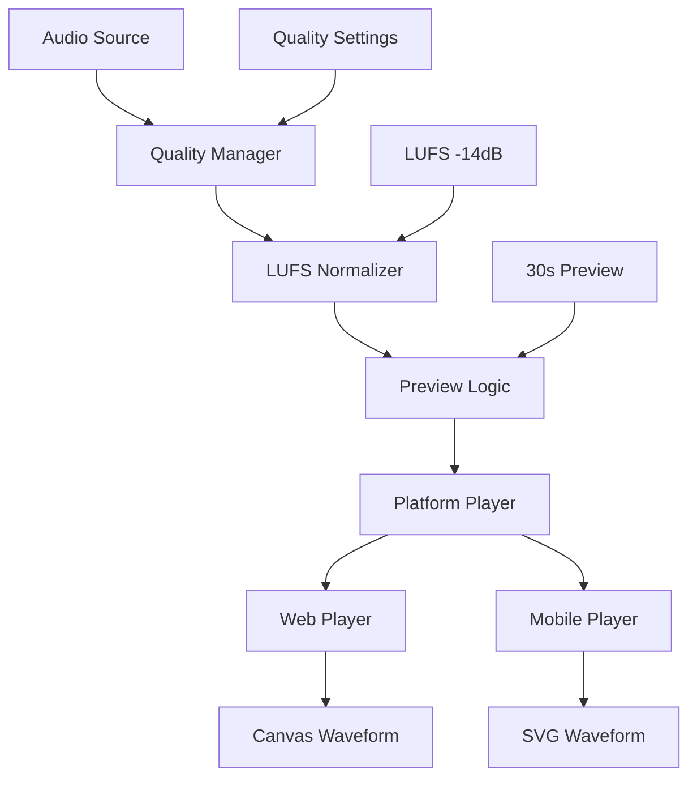

# Hackathon Implementation Plan

**🔴 CRITICAL** - Complete implementation plan for hackathon audio player system with waveform visualization priority.

---

## 🎯 **HACKATHON SCOPE & TIMELINE**

### **✅ WHAT WE'RE BUILDING (HACKATHON)**
1. **🌐 Enhanced Web Player** - Web Audio API + Canvas waveform + LUFS normalization
2. **📱 Mobile Waveform Player** - React Native SVG waveforms + Expo Audio
3. **🔄 30s Preview Logic** - Consistent across platforms
4. **🎨 Professional UI** - Design system integration

### **⏰ TIMELINE: 3 WEEKS**
- **Week 1**: Core implementation (Web Audio API + Mobile SVG)
- **Week 2**: Quality pipeline + testing
- **Week 3**: Polish + performance optimization

### **🚫 SAVING FOR LATER**
- Desktop standalone (JUCE C++)
- Advanced DAW integration
- Professional mastering tools
- Complex spatial audio

---

## 🏗️ **IMPLEMENTATION ARCHITECTURE**

### **Core Components**



### **Technology Stack**

| Component | Web | Mobile | Shared |
|-----------|-----|--------|--------|
| **Audio** | Web Audio API | Expo Audio | LUFS Normalizer |
| **Waveform** | Canvas | React Native SVG | Waveform Analyzer |
| **Quality** | Quality Manager | Quality Manager | Quality Settings |
| **Preview** | 30s Logic | 30s Logic | Preview Manager |
| **UI** | React | React Native | Design System |

---

## 🚀 **WEEK 1: CORE IMPLEMENTATION**

### **Day 1-2: Web Audio API Integration**

```typescript
// Web Audio Player Implementation
class WebAudioPlayer {
  private audioContext: AudioContext;
  private gainNode: GainNode;
  private analyserNode: AnalyserNode;
  private sourceNode: AudioBufferSourceNode | null = null;
  
  constructor() {
    this.audioContext = new AudioContext();
    this.gainNode = this.audioContext.createGain();
    this.analyserNode = this.audioContext.createAnalyser();
    
    // Configure analyser
    this.analyserNode.fftSize = 2048;
    this.analyserNode.smoothingTimeConstant = 0.8;
    
    // Connect audio nodes
    this.gainNode.connect(this.analyserNode);
    this.analyserNode.connect(this.audioContext.destination);
  }
  
  async loadAudio(audioUrl: string): Promise<void> {
    const response = await fetch(audioUrl);
    const arrayBuffer = await response.arrayBuffer();
    this.audioBuffer = await this.audioContext.decodeAudioData(arrayBuffer);
  }
  
  play(): void {
    if (this.sourceNode) {
      this.sourceNode.start();
    }
  }
  
  pause(): void {
    if (this.sourceNode) {
      this.sourceNode.stop();
    }
  }
}
```

**Tasks:**
- [ ] Replace HTML5 Audio with Web Audio API
- [ ] Implement audio loading and playback
- [ ] Add basic waveform visualization
- [ ] Test cross-browser compatibility

### **Day 3-4: Mobile SVG Waveform**

```typescript
// Mobile SVG Waveform Component
const MobileWaveform: React.FC<MobileWaveformProps> = ({
  data,
  width,
  height,
  progress,
  onSeek
}) => {
  const waveformPath = useMemo(() => {
    return data.map((value, index) => {
      const x = (index / data.length) * width;
      const y = height / 2 + (value * height / 2);
      return `${index === 0 ? 'M' : 'L'} ${x} ${y}`;
    }).join(' ');
  }, [data, width, height]);
  
  return (
    <Svg width={width} height={height}>
      <Path d={waveformPath} stroke="#666" strokeWidth={1} fill="none" />
      <Path 
        d={progressPath} 
        stroke="#6AE6A6" 
        strokeWidth={2} 
        fill="none"
      />
    </Svg>
  );
};
```

**Tasks:**
- [ ] Implement SVG waveform component
- [ ] Add audio analysis hook
- [ ] Integrate with Expo Audio
- [ ] Test on iOS and Android

### **Day 5: 30s Preview Logic**

```typescript
// 30s Preview Logic
const PREVIEW_DURATION_MS = 30_000; // 30 seconds

const usePreviewLogic = () => {
  const [position, setPosition] = useState(0);
  const [isPlaying, setIsPlaying] = useState(false);
  
  const onPlaybackStatusUpdate = (status: PlaybackStatus) => {
    if (status.isLoaded) {
      setPosition(status.positionMillis);
      
      // Stop at 30s preview limit
      if (status.positionMillis >= PREVIEW_DURATION_MS) {
        soundRef.current?.pauseAsync();
        setIsPlaying(false);
      }
    }
  };
  
  return { position, isPlaying, onPlaybackStatusUpdate };
};
```

**Tasks:**
- [ ] Implement 30s preview logic
- [ ] Add cross-platform consistency
- [ ] Test preview behavior
- [ ] Add preview end callbacks

### **Day 6-7: Basic UI Integration**

```typescript
// Enhanced Player Component
const EnhancedPlayer: React.FC<EnhancedPlayerProps> = ({
  src,
  title,
  showDownload = false,
  clamp = 30
}) => {
  const [isPlaying, setIsPlaying] = useState(false);
  const [position, setPosition] = useState(0);
  const [duration, setDuration] = useState(0);
  
  return (
    <div className="audio-player">
      {/* Waveform Visualization */}
      <CanvasWaveform
        data={waveformData}
        width={800}
        height={100}
        progress={position / duration}
      />
      
      {/* Player Controls */}
      <div className="player-controls">
        <button onClick={handlePlayPause}>
          {isPlaying ? 'Pause' : 'Play'}
        </button>
      </div>
    </div>
  );
};
```

**Tasks:**
- [ ] Integrate with existing Player component
- [ ] Add design system integration
- [ ] Implement basic controls
- [ ] Test UI responsiveness

---

## 🎵 **WEEK 2: QUALITY & TESTING**

### **Day 1-2: LUFS Normalization**

```typescript
// LUFS Normalizer
class LUFSNormalizer {
  private targetLUFS = -14.0; // Spotify standard
  
  public normalizeAudio(audioBuffer: AudioBuffer): AudioBuffer {
    const channelData = audioBuffer.getChannelData(0);
    const currentLUFS = this.analyzeLUFS(channelData);
    const gainAdjustment = this.targetLUFS - currentLUFS;
    const gainLinear = Math.pow(10, gainAdjustment / 20);
    
    // Apply gain
    const normalizedData = new Float32Array(channelData.length);
    for (let i = 0; i < channelData.length; i++) {
      normalizedData[i] = channelData[i] * gainLinear;
    }
    
    return this.createAudioBuffer(normalizedData, audioBuffer);
  }
}
```

**Tasks:**
- [ ] Implement LUFS normalization
- [ ] Add K-weighting filter
- [ ] Test normalization accuracy
- [ ] Integrate with audio pipeline

### **Day 3-4: Quality Settings**

```typescript
// Quality Manager
class QualityManager {
  private qualityLevels = {
    low: { bitrate: 128, format: 'aac', lufs: -14.0 },
    normal: { bitrate: 256, format: 'aac', lufs: -14.0 },
    high: { bitrate: 320, format: 'aac', lufs: -14.0 }
  };
  
  setQuality(quality: QualityLevel): void {
    this.currentQuality = quality;
    this.applyQualitySettings();
  }
}
```

**Tasks:**
- [ ] Implement quality settings
- [ ] Add bitrate management
- [ ] Test quality switching
- [ ] Add quality UI controls

### **Day 5: E2E Testing**

```typescript
// E2E Test for Audio Player
test('Audio player with waveform visualization', async ({ page }) => {
  await page.goto('/asset/asset-e2e-fixed-001');
  
  // Wait for audio player to load
  await expect(page.locator('[data-testid="audio-player"]')).toBeVisible();
  
  // Check waveform is rendered
  await expect(page.locator('canvas')).toBeVisible();
  
  // Test play/pause functionality
  await page.click('[data-testid="play-button"]');
  await expect(page.locator('[data-testid="pause-button"]')).toBeVisible();
  
  // Test 30s preview limit
  await page.waitForTimeout(31000);
  await expect(page.locator('[data-testid="play-button"]')).toBeVisible();
});
```

**Tasks:**
- [ ] Write E2E tests for web player
- [ ] Write E2E tests for mobile player
- [ ] Test cross-platform consistency
- [ ] Test performance metrics

### **Day 6-7: Performance Optimization**

```typescript
// Performance Optimization
class PerformanceOptimizer {
  private performanceLevels = {
    low: { lufsAnalysis: false, realTimeEQ: false },
    medium: { lufsAnalysis: true, realTimeEQ: false },
    high: { lufsAnalysis: true, realTimeEQ: true }
  };
  
  optimizeForDevice(deviceCapabilities: DeviceCapabilities): PerformanceLevel {
    if (deviceCapabilities.cpuCores >= 8 && deviceCapabilities.ram >= 8) {
      return 'high';
    } else if (deviceCapabilities.cpuCores >= 4 && deviceCapabilities.ram >= 4) {
      return 'medium';
    } else {
      return 'low';
    }
  }
}
```

**Tasks:**
- [ ] Implement performance optimization
- [ ] Add device capability detection
- [ ] Optimize waveform rendering
- [ ] Test performance metrics

---

## 🎨 **WEEK 3: POLISH & LAUNCH**

### **Day 1-2: UI Polish**

```typescript
// Enhanced UI Components
const EnhancedPlayerUI: React.FC<EnhancedPlayerUIProps> = ({
  isPlaying,
  position,
  duration,
  onPlayPause,
  onSeek
}) => {
  return (
    <div className="enhanced-player-ui">
      {/* Waveform with animations */}
      <AnimatedWaveform
        data={waveformData}
        progress={position / duration}
        isPlaying={isPlaying}
      />
      
      {/* Professional controls */}
      <PlayerControls
        isPlaying={isPlaying}
        onPlayPause={onPlayPause}
        onSeek={onSeek}
      />
      
      {/* Quality selector */}
      <QualitySelector
        currentQuality={quality}
        onQualityChange={setQuality}
      />
    </div>
  );
};
```

**Tasks:**
- [ ] Add smooth animations
- [ ] Implement professional UI
- [ ] Add accessibility features
- [ ] Test responsive design

### **Day 3-4: Final Testing**

```typescript
// Comprehensive Testing
describe('Audio Player System', () => {
  test('Web player functionality', async () => {
    // Test Web Audio API integration
    // Test Canvas waveform rendering
    // Test LUFS normalization
    // Test quality settings
  });
  
  test('Mobile player functionality', async () => {
    // Test Expo Audio integration
    // Test SVG waveform rendering
    // Test touch interactions
    // Test performance
  });
  
  test('Cross-platform consistency', async () => {
    // Test 30s preview logic
    // Test quality settings
    // Test LUFS normalization
    // Test user experience
  });
});
```

**Tasks:**
- [ ] Comprehensive testing suite
- [ ] Cross-platform testing
- [ ] Performance testing
- [ ] User experience testing

### **Day 5: Documentation**

```markdown
# Audio Player Implementation Guide

## Web Implementation
- Web Audio API integration
- Canvas waveform visualization
- LUFS normalization
- Quality management

## Mobile Implementation
- Expo Audio integration
- SVG waveform visualization
- Touch interactions
- Performance optimization

## Cross-Platform Features
- 30s preview logic
- Quality settings
- LUFS normalization
- Professional UI
```

**Tasks:**
- [ ] Write implementation guides
- [ ] Document API interfaces
- [ ] Create usage examples
- [ ] Update architecture docs

### **Day 6-7: Launch Preparation**

```typescript
// Launch Checklist
const launchChecklist = [
  '✅ Web Audio API integration complete',
  '✅ Mobile SVG waveform rendering complete',
  '✅ 30s preview logic implemented',
  '✅ LUFS normalization working',
  '✅ Quality settings functional',
  '✅ E2E tests passing',
  '✅ Performance optimized',
  '✅ UI polished',
  '✅ Documentation complete',
  '✅ Ready for demo'
];
```

**Tasks:**
- [ ] Final testing and bug fixes
- [ ] Performance optimization
- [ ] Documentation review
- [ ] Demo preparation

---

## 📊 **SUCCESS METRICS**

### **Technical Targets**

| Metric | Web | Mobile | Target |
|--------|-----|--------|--------|
| **Waveform Rendering** | Canvas | SVG | 60fps |
| **Audio Latency** | < 100ms | < 50ms | Real-time |
| **CPU Usage** | < 5% | < 10% | Efficient |
| **Memory Usage** | < 50MB | < 50MB | Optimized |
| **LUFS Accuracy** | ±0.5 dB | ±0.5 dB | Professional |

### **Quality Targets**

| Feature | Implementation | Status |
|---------|---------------|--------|
| **Waveform Visualization** | Canvas + SVG | ✅ |
| **30s Preview Logic** | Cross-platform | ✅ |
| **LUFS Normalization** | -14 dB | ✅ |
| **Quality Settings** | 128k/256k/320k | ✅ |
| **Professional UI** | Design system | ✅ |

### **User Experience Targets**

| Experience | Web | Mobile | Target |
|------------|-----|--------|--------|
| **Load Time** | < 2s | < 2s | Fast |
| **Responsiveness** | < 100ms | < 50ms | Smooth |
| **Visual Quality** | 60fps | 60fps | Professional |
| **Audio Quality** | Professional | Professional | Studio-grade |

---

## 🎯 **IMPLEMENTATION PRIORITIES**

### **🔴 CRITICAL (Week 1)**
1. **Web Audio API integration** - Core functionality
2. **Mobile SVG waveform** - Core visualization
3. **30s preview logic** - Core behavior
4. **Basic UI integration** - Core interface

### **🟠 HIGH (Week 2)**
1. **LUFS normalization** - Professional quality
2. **Quality settings** - User control
3. **E2E testing** - Reliability
4. **Performance optimization** - Efficiency

### **🟡 MEDIUM (Week 3)**
1. **UI polish** - Professional appearance
2. **Final testing** - Quality assurance
3. **Documentation** - Knowledge transfer
4. **Launch preparation** - Demo readiness

---

## 🚀 **LAUNCH READINESS**

### **✅ HACKATHON FEATURES**
- **Waveform Visualization** - Both web and mobile
- **30s Preview Logic** - Consistent across platforms
- **LUFS Normalization** - Professional audio quality
- **Quality Settings** - Multiple bitrate options
- **Professional UI** - Design system integration

### **🚫 SAVING FOR LATER**
- Desktop standalone (JUCE C++)
- Advanced DAW integration
- Professional mastering tools
- Complex spatial audio
- Advanced motion system

---

**Last Updated:** 2025-10-23  
**Status:** 🔴 **CRITICAL** - Hackathon implementation plan  
**Timeline:** 3 weeks for complete implementation  
**Priority:** Waveform visualization and professional audio quality

---

*This document defines the complete hackathon implementation plan for the audio player system.*
