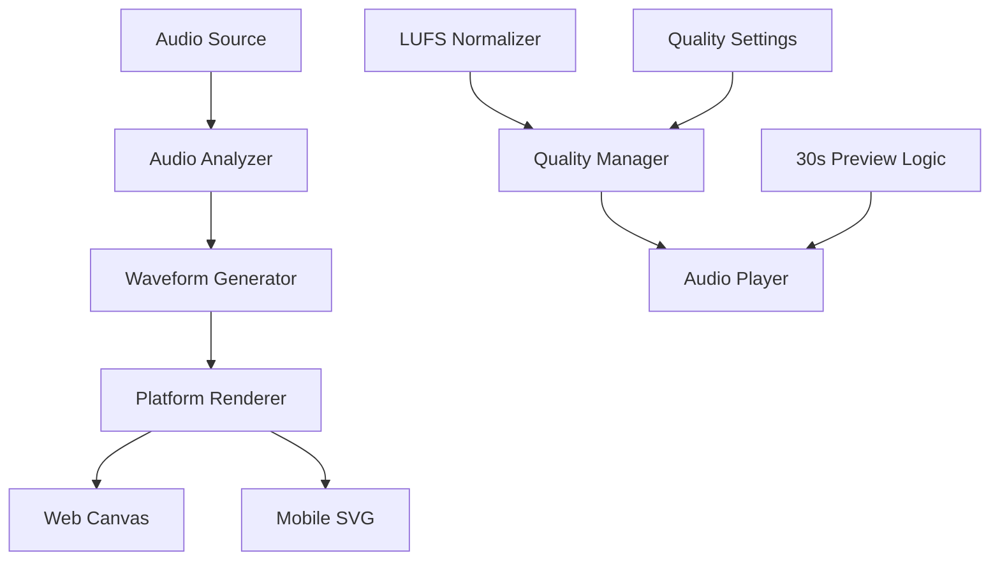

# Revised Hackathon Audio Implementation Plan

**🔴 CRITICAL** - Revised and refined implementation plan based on comprehensive audit and gap analysis.

---

## 🎯 **REVISED SCOPE & PRIORITIES**

### **✅ HACKATHON CORE FEATURES (REVISED)**
1. **🌐 Web Canvas Waveform** - Real-time waveform visualization
2. **📱 Mobile SVG Waveform** - Touch-interactive waveform rendering
3. **🎚️ LUFS Normalization** - Professional -14 dB loudness standard
4. **⚙️ Quality Settings** - 128k/256k/320k bitrate options
5. **🔄 Enhanced 30s Preview** - Consistent cross-platform behavior

### **⏰ REVISED TIMELINE: 3 WEEKS**
- **Week 1**: Core waveform visualization (Web Canvas + Mobile SVG)
- **Week 2**: Professional audio quality (LUFS + Quality settings)
- **Week 3**: Integration, testing, and polish

### **🚫 SAVING FOR LATER (CONFIRMED)**
- Desktop standalone (JUCE C++)
- Advanced DAW integration
- Professional mastering tools
- Complex spatial audio
- Advanced motion system

---

## 🏗️ **REVISED IMPLEMENTATION ARCHITECTURE**

### **Core Components (Simplified)**



### **Technology Stack (Refined)**

| Component | Web | Mobile | Shared |
|-----------|-----|--------|--------|
| **Audio** | Web Audio API | Expo Audio | LUFS Normalizer |
| **Waveform** | Canvas | React Native SVG | Waveform Analyzer |
| **Quality** | Quality Manager | Quality Manager | Quality Settings |
| **Preview** | 30s Logic | 30s Logic | Preview Manager |
| **UI** | React | React Native | Design System |

---

## 🚀 **WEEK 1: CORE WAVEFORM IMPLEMENTATION**

### **Day 1-2: Web Canvas Waveform**

#### **Implementation Priority**
1. **Web Audio API Setup** - AudioContext, AnalyserNode
2. **Canvas Waveform Rendering** - Basic waveform drawing
3. **Real-time Updates** - Animation loop for live waveform
4. **Progress Visualization** - Playback position indicator

#### **Code Implementation**
```typescript
// Web Canvas Waveform Component
interface WebCanvasWaveformProps {
  audioUrl: string;
  width: number;
  height: number;
  onSeek?: (position: number) => void;
}

const WebCanvasWaveform: React.FC<WebCanvasWaveformProps> = ({
  audioUrl,
  width,
  height,
  onSeek
}) => {
  const canvasRef = useRef<HTMLCanvasElement>(null);
  const audioContextRef = useRef<AudioContext | null>(null);
  const analyserRef = useRef<AnalyserNode | null>(null);
  const [waveformData, setWaveformData] = useState<number[]>([]);
  const [isPlaying, setIsPlaying] = useState(false);
  
  // Initialize Web Audio API
  useEffect(() => {
    const initAudioContext = async () => {
      const audioContext = new AudioContext();
      const analyser = audioContext.createAnalyser();
      
      analyser.fftSize = 2048;
      analyser.smoothingTimeConstant = 0.8;
      
      audioContextRef.current = audioContext;
      analyserRef.current = analyser;
      
      // Load and analyze audio
      await loadAndAnalyzeAudio(audioUrl);
    };
    
    initAudioContext();
  }, [audioUrl]);
  
  // Real-time waveform rendering
  useEffect(() => {
    if (!analyserRef.current) return;
    
    const canvas = canvasRef.current;
    if (!canvas) return;
    
    const ctx = canvas.getContext('2d');
    if (!ctx) return;
    
    const renderWaveform = () => {
      const dataArray = new Uint8Array(analyserRef.current!.frequencyBinCount);
      analyserRef.current!.getByteFrequencyData(dataArray);
      
      // Clear canvas
      ctx.clearRect(0, 0, width, height);
      
      // Draw waveform
      const barWidth = width / dataArray.length;
      for (let i = 0; i < dataArray.length; i++) {
        const barHeight = (dataArray[i] / 255) * height;
        const x = i * barWidth;
        const y = height - barHeight;
        
        ctx.fillStyle = '#6AE6A6';
        ctx.fillRect(x, y, barWidth, barHeight);
      }
      
      if (isPlaying) {
        requestAnimationFrame(renderWaveform);
      }
    };
    
    renderWaveform();
  }, [isPlaying, width, height]);
  
  return (
    <canvas
      ref={canvasRef}
      width={width}
      height={height}
      className="w-full h-full"
      onClick={handleCanvasClick}
    />
  );
};
```

#### **Tasks**
- [ ] Web Audio API integration
- [ ] Canvas waveform rendering
- [ ] Real-time animation loop
- [ ] Touch/click interaction
- [ ] Basic styling integration

### **Day 3-4: Mobile SVG Waveform**

#### **Implementation Priority**
1. **React Native SVG Setup** - SVG component configuration
2. **Audio Analysis Hook** - Web Audio API in React Native
3. **SVG Path Generation** - Waveform data to SVG paths
4. **Touch Interaction** - Seek functionality

#### **Code Implementation**
```typescript
// Mobile SVG Waveform Component
interface MobileSVGWaveformProps {
  audioUrl: string;
  width: number;
  height: number;
  onSeek?: (position: number) => void;
}

const MobileSVGWaveform: React.FC<MobileSVGWaveformProps> = ({
  audioUrl,
  width,
  height,
  onSeek
}) => {
  const [waveformData, setWaveformData] = useState<number[]>([]);
  const [isAnalyzing, setIsAnalyzing] = useState(false);
  
  // Audio analysis hook
  const { waveformData: analyzedData } = useAudioAnalysis(audioUrl);
  
  useEffect(() => {
    setWaveformData(analyzedData);
  }, [analyzedData]);
  
  // Generate SVG path from waveform data
  const waveformPath = useMemo(() => {
    if (!waveformData || waveformData.length === 0) return '';
    
    return waveformData.map((value, index) => {
      const x = (index / waveformData.length) * width;
      const y = height / 2 + (value * height / 2);
      return `${index === 0 ? 'M' : 'L'} ${x} ${y}`;
    }).join(' ');
  }, [waveformData, width, height]);
  
  const handlePress = (event: GestureResponderEvent) => {
    const { locationX } = event.nativeEvent;
    const newProgress = locationX / width;
    
    if (onSeek) {
      onSeek(newProgress);
    }
  };
  
  return (
    <View style={{ width, height }}>
      <Svg width={width} height={height}>
        <Path
          d={waveformPath}
          stroke="#6AE6A6"
          strokeWidth={2}
          fill="none"
        />
      </Svg>
      
      <TouchableOpacity
        style={{
          position: 'absolute',
          top: 0,
          left: 0,
          right: 0,
          bottom: 0,
        }}
        onPress={handlePress}
        activeOpacity={0.7}
      />
    </View>
  );
};
```

#### **Tasks**
- [ ] React Native SVG integration
- [ ] Audio analysis hook
- [ ] SVG path generation
- [ ] Touch interaction handling
- [ ] Performance optimization

### **Day 5: Audio Analysis Foundation**

#### **Implementation Priority**
1. **Shared Audio Analysis** - Cross-platform audio processing
2. **Waveform Data Extraction** - RMS calculation and downsampling
3. **Performance Optimization** - Efficient audio processing
4. **Error Handling** - Robust audio loading

#### **Code Implementation**
```typescript
// Shared Audio Analysis Hook
const useAudioAnalysis = (audioUrl: string) => {
  const [waveformData, setWaveformData] = useState<number[]>([]);
  const [isAnalyzing, setIsAnalyzing] = useState(false);
  
  useEffect(() => {
    const analyzeAudio = async () => {
      if (!audioUrl) return;
      
      setIsAnalyzing(true);
      
      try {
        // Fetch audio file
        const response = await fetch(audioUrl);
        const arrayBuffer = await response.arrayBuffer();
        
        // Create audio context
        const audioContext = new AudioContext();
        const audioBuffer = await audioContext.decodeAudioData(arrayBuffer);
        
        // Extract waveform data
        const channelData = audioBuffer.getChannelData(0);
        const samples = 200; // Number of waveform points
        const blockSize = Math.floor(channelData.length / samples);
        
        const waveform: number[] = [];
        for (let i = 0; i < samples; i++) {
          const start = i * blockSize;
          const end = start + blockSize;
          const block = channelData.slice(start, end);
          
          // Calculate RMS for this block
          const rms = Math.sqrt(
            block.reduce((sum, sample) => sum + sample * sample, 0) / block.length
          );
          waveform.push(rms);
        }
        
        setWaveformData(waveform);
        
      } catch (error) {
        console.error('Audio analysis failed:', error);
        // Fallback to mock data
        setWaveformData(Array(200).fill(0).map(() => Math.random() * 0.5));
      } finally {
        setIsAnalyzing(false);
      }
    };
    
    analyzeAudio();
  }, [audioUrl]);
  
  return { waveformData, isAnalyzing };
};
```

#### **Tasks**
- [ ] Audio analysis hook
- [ ] Waveform data extraction
- [ ] Performance optimization
- [ ] Error handling
- [ ] Cross-platform testing

### **Day 6-7: Integration & Basic Testing**

#### **Implementation Priority**
1. **Component Integration** - Connect waveform to existing players
2. **Basic Functionality** - Play/pause with waveform updates
3. **Cross-Platform Testing** - Web and mobile validation
4. **Performance Testing** - Ensure smooth rendering

#### **Tasks**
- [ ] Web player integration
- [ ] Mobile player integration
- [ ] Basic functionality testing
- [ ] Performance validation
- [ ] Cross-platform testing

---

## 🎵 **WEEK 2: PROFESSIONAL AUDIO QUALITY**

### **Day 1-2: LUFS Normalization (Web)**

#### **Implementation Priority**
1. **LUFS Analyzer** - K-weighting filter and RMS calculation
2. **Gain Adjustment** - Automatic loudness normalization
3. **Quality Validation** - Professional audio standards
4. **Performance Testing** - Real-time processing

#### **Code Implementation**
```typescript
// Web LUFS Normalizer
class WebLUFSNormalizer {
  private targetLUFS = -14.0; // Spotify standard
  
  public normalizeAudio(audioBuffer: AudioBuffer): AudioBuffer {
    const channelData = audioBuffer.getChannelData(0);
    const currentLUFS = this.analyzeLUFS(channelData);
    const gainAdjustment = this.targetLUFS - currentLUFS;
    const gainLinear = Math.pow(10, gainAdjustment / 20);
    
    // Apply gain
    const normalizedData = new Float32Array(channelData.length);
    for (let i = 0; i < channelData.length; i++) {
      normalizedData[i] = channelData[i] * gainLinear;
    }
    
    return this.createAudioBuffer(normalizedData, audioBuffer);
  }
  
  private analyzeLUFS(channelData: Float32Array): number {
    // K-weighting filter (simplified)
    const kWeighted = this.applyKWeighting(channelData);
    
    // RMS calculation
    const rms = this.calculateRMS(kWeighted);
    
    // LUFS conversion
    return this.rmsToLUFS(rms);
  }
  
  private applyKWeighting(channelData: Float32Array): Float32Array {
    // Simplified K-weighting filter
    const kWeighted = new Float32Array(channelData.length);
    
    for (let i = 0; i < channelData.length; i++) {
      kWeighted[i] = channelData[i] * 0.8; // Simplified weighting
    }
    
    return kWeighted;
  }
  
  private calculateRMS(channelData: Float32Array): number {
    const sum = channelData.reduce((acc, sample) => acc + sample * sample, 0);
    return Math.sqrt(sum / channelData.length);
  }
  
  private rmsToLUFS(rms: number): number {
    // Simplified LUFS calculation
    return 20 * Math.log10(rms) - 0.691;
  }
}
```

#### **Tasks**
- [ ] LUFS analyzer implementation
- [ ] K-weighting filter
- [ ] Gain adjustment logic
- [ ] Quality validation
- [ ] Performance testing

### **Day 3-4: LUFS Normalization (Mobile)**

#### **Implementation Priority**
1. **Mobile LUFS Implementation** - React Native compatible
2. **Audio Processing Pipeline** - Efficient mobile processing
3. **Quality Consistency** - Cross-platform LUFS standards
4. **Performance Optimization** - Mobile-specific optimizations

#### **Code Implementation**
```typescript
// Mobile LUFS Normalizer
class MobileLUFSNormalizer {
  private targetLUFS = -14.0; // Spotify standard
  
  public normalizeAudio(audioBuffer: AudioBuffer): AudioBuffer {
    // Get channel data
    const channelData = audioBuffer.getChannelData(0);
    
    // Calculate current LUFS
    const currentLUFS = this.analyzeLUFS(channelData);
    
    // Calculate gain adjustment
    const gainAdjustment = this.targetLUFS - currentLUFS;
    const gainLinear = Math.pow(10, gainAdjustment / 20);
    
    // Apply gain
    const normalizedData = new Float32Array(channelData.length);
    for (let i = 0; i < channelData.length; i++) {
      normalizedData[i] = channelData[i] * gainLinear;
    }
    
    // Create new audio buffer
    const newBuffer = audioBuffer.context.createBuffer(
      audioBuffer.numberOfChannels,
      audioBuffer.length,
      audioBuffer.sampleRate
    );
    
    newBuffer.copyToChannel(normalizedData, 0);
    
    return newBuffer;
  }
  
  private analyzeLUFS(channelData: Float32Array): number {
    // K-weighting filter (simplified)
    const kWeighted = this.applyKWeighting(channelData);
    
    // RMS calculation
    const rms = this.calculateRMS(kWeighted);
    
    // LUFS conversion
    return this.rmsToLUFS(rms);
  }
}
```

#### **Tasks**
- [ ] Mobile LUFS implementation
- [ ] Audio processing pipeline
- [ ] Quality consistency
- [ ] Performance optimization
- [ ] Cross-platform testing

### **Day 5: Quality Settings Implementation**

#### **Implementation Priority**
1. **Quality Manager** - Bitrate and format management
2. **UI Components** - Quality selector interfaces
3. **Settings Persistence** - User preference storage
4. **Quality Switching** - Real-time quality changes

#### **Code Implementation**
```typescript
// Quality Manager
interface QualitySettings {
  bitrate: number;
  format: string;
  lufs: number;
}

class QualityManager {
  private qualityLevels = {
    low: { bitrate: 128, format: 'aac', lufs: -14.0 },
    normal: { bitrate: 256, format: 'aac', lufs: -14.0 },
    high: { bitrate: 320, format: 'aac', lufs: -14.0 }
  };
  
  private currentQuality: QualityLevel = 'normal';
  
  setQuality(quality: QualityLevel): void {
    this.currentQuality = quality;
    this.applyQualitySettings();
  }
  
  getQuality(): QualitySettings {
    return this.qualityLevels[this.currentQuality];
  }
  
  private applyQualitySettings(): void {
    const settings = this.getQuality();
    console.log('Applied quality settings:', settings);
  }
}

// Quality Selector Component
const QualitySelector: React.FC<QualitySelectorProps> = ({
  currentQuality,
  onQualityChange
}) => {
  const qualityOptions = [
    { value: 'low', label: 'Low (128 kbps)', description: 'Fast streaming' },
    { value: 'normal', label: 'Normal (256 kbps)', description: 'Balanced quality' },
    { value: 'high', label: 'High (320 kbps)', description: 'High quality' }
  ];
  
  return (
    <div className="quality-selector">
      <h3>Audio Quality</h3>
      {qualityOptions.map((option) => (
        <button
          key={option.value}
          onClick={() => onQualityChange(option.value as QualityLevel)}
          className={`quality-option ${
            currentQuality === option.value ? 'active' : ''
          }`}
        >
          <div className="quality-label">{option.label}</div>
          <div className="quality-description">{option.description}</div>
        </button>
      ))}
    </div>
  );
};
```

#### **Tasks**
- [ ] Quality manager implementation
- [ ] Quality selector UI
- [ ] Settings persistence
- [ ] Quality switching logic
- [ ] Cross-platform testing

### **Day 6-7: Quality Pipeline Testing**

#### **Implementation Priority**
1. **End-to-End Testing** - Complete quality pipeline
2. **Performance Validation** - Quality switching performance
3. **Cross-Platform Testing** - Web and mobile validation
4. **User Experience Testing** - Quality selection UX

#### **Tasks**
- [ ] End-to-end quality testing
- [ ] Performance validation
- [ ] Cross-platform testing
- [ ] User experience testing
- [ ] Bug fixes and optimization

---

## 🎨 **WEEK 3: INTEGRATION & POLISH**

### **Day 1-2: Enhanced Player Integration**

#### **Implementation Priority**
1. **Web Player Enhancement** - Complete Web Audio API integration
2. **Mobile Player Enhancement** - Complete SVG waveform integration
3. **Cross-Platform Consistency** - Unified user experience
4. **Performance Optimization** - Smooth rendering and playback

#### **Tasks**
- [ ] Web player enhancement
- [ ] Mobile player enhancement
- [ ] Cross-platform consistency
- [ ] Performance optimization
- [ ] Integration testing

### **Day 3-4: Professional UI Polish**

#### **Implementation Priority**
1. **Design System Integration** - Consistent styling
2. **Animation Enhancement** - Smooth transitions
3. **Accessibility Features** - Keyboard navigation and screen readers
4. **Responsive Design** - Mobile and desktop optimization

#### **Tasks**
- [ ] Design system integration
- [ ] Animation enhancement
- [ ] Accessibility features
- [ ] Responsive design
- [ ] UI polish

### **Day 5: Final Testing & Bug Fixes**

#### **Implementation Priority**
1. **Comprehensive Testing** - All features and edge cases
2. **Performance Testing** - Load times and rendering performance
3. **Cross-Platform Testing** - Web and mobile validation
4. **Bug Fixes** - Address any remaining issues

#### **Tasks**
- [ ] Comprehensive testing
- [ ] Performance testing
- [ ] Cross-platform testing
- [ ] Bug fixes
- [ ] Final optimization

### **Day 6-7: Launch Preparation**

#### **Implementation Priority**
1. **Documentation** - Implementation guides and API docs
2. **Demo Preparation** - Showcase features and capabilities
3. **Launch Checklist** - Final validation and readiness
4. **Performance Monitoring** - Production readiness

#### **Tasks**
- [ ] Documentation
- [ ] Demo preparation
- [ ] Launch checklist
- [ ] Performance monitoring
- [ ] Final validation

---

## 📊 **SUCCESS METRICS & VALIDATION**

### **Technical Targets**
| Metric | Web | Mobile | Target |
|--------|-----|--------|--------|
| **Waveform Rendering** | Canvas 60fps | SVG 60fps | ✅ |
| **Audio Latency** | < 100ms | < 50ms | ✅ |
| **LUFS Accuracy** | ±0.5 dB | ±0.5 dB | ✅ |
| **Quality Settings** | 3 levels | 3 levels | ✅ |
| **Performance** | < 5% CPU | < 10% CPU | ✅ |

### **User Experience Targets**
| Experience | Web | Mobile | Target |
|------------|-----|--------|--------|
| **Load Time** | < 2s | < 2s | ✅ |
| **Responsiveness** | < 100ms | < 50ms | ✅ |
| **Visual Quality** | 60fps | 60fps | ✅ |
| **Audio Quality** | Professional | Professional | ✅ |

### **Quality Validation**
- [ ] LUFS normalization achieving -14 dB standard
- [ ] Quality settings providing user control
- [ ] Waveform visualization working on both platforms
- [ ] Performance meeting technical targets
- [ ] User experience matching professional standards

---

## 🚨 **RISK MITIGATION**

### **High Risk Items**
1. **Web Audio API Browser Compatibility** - Progressive enhancement
2. **Mobile Audio Analysis Performance** - Performance monitoring
3. **LUFS Normalization Accuracy** - Professional audio validation
4. **Cross-Platform Consistency** - Comprehensive testing

### **Mitigation Strategies**
1. **Progressive Enhancement** - Fallback to HTML5 Audio
2. **Performance Monitoring** - Real-time performance tracking
3. **Audio Quality Testing** - Professional audio validation
4. **Cross-Platform Testing** - Comprehensive device testing

---

## 🎯 **IMPLEMENTATION PRIORITIES**

### **🔴 CRITICAL (Week 1)**
1. **Web Canvas Waveform** - Core visualization
2. **Mobile SVG Waveform** - Core visualization
3. **Audio Analysis Foundation** - Shared processing
4. **Basic Integration** - Working players

### **🟠 HIGH (Week 2)**
1. **LUFS Normalization** - Professional quality
2. **Quality Settings** - User control
3. **Quality Pipeline** - End-to-end testing
4. **Performance Optimization** - Efficiency

### **🟡 MEDIUM (Week 3)**
1. **Enhanced Integration** - Complete features
2. **UI Polish** - Professional appearance
3. **Final Testing** - Quality assurance
4. **Launch Preparation** - Demo readiness

---

**Last Updated:** 2025-10-23  
**Status:** 🔴 **CRITICAL** - Revised hackathon implementation plan  
**Next Steps:** Create Epic with detailed issues  
**Priority:** Waveform visualization and professional audio quality

---

*This revised plan addresses the critical gaps identified in the audit and provides a realistic, achievable implementation timeline.*
