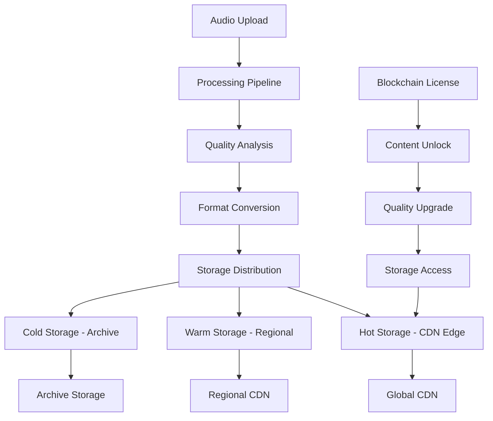

# Storage & CDN Strategy Architecture

**🟠 HIGH** - Comprehensive storage and CDN architecture for global audio content delivery.

---

## 🎯 **OVERVIEW**

The Storage & CDN Strategy defines how GotMusic stores, processes, and delivers audio content globally. It ensures **fast, reliable, and cost-effective** content delivery while maintaining **professional audio quality** and **blockchain integration**.

### **Key Features**
- **🌐 Global CDN**: 200+ edge locations worldwide
- **📊 Multi-Tier Storage**: Hot, warm, and cold storage optimization
- **🔄 Real-time Processing**: Live audio transcoding and optimization
- **💰 Cost Optimization**: Intelligent storage tiering and caching

---

## 🏗️ **STORAGE ARCHITECTURE**

### **Multi-Tier Storage Strategy**



### **Storage Tiers**

| Tier | Provider | Use Case | Cost | Performance | TTL |
|------|----------|----------|------|-------------|-----|
| 🔴 **Hot** | Cloudflare R2 | 30s previews | $0.015/GB | < 50ms | 24h |
| 🟠 **Warm** | AWS S3 | Full streaming | $0.023/GB | < 200ms | 7d |
| 🟡 **Cold** | AWS Glacier | Licensed content | $0.004/GB | < 5s | 30d |
| 🟢 **Archive** | AWS Deep Archive | Masters | $0.00099/GB | < 12h | Permanent |

---

## 🌐 **CDN STRATEGY**

### **Global CDN Architecture**

```typescript
// CDN Configuration
interface CDNConfig {
  // Cloudflare R2 (Hot Storage)
  hotStorage: {
    provider: 'Cloudflare R2';
    regions: ['us-east-1', 'eu-west-1', 'ap-southeast-1'];
    edgeLocations: 200;
    cacheTTL: '24h';
    compression: 'gzip + brotli';
    cost: '$0.015/GB/month';
  };
  
  // AWS S3 (Warm Storage)
  warmStorage: {
    provider: 'AWS S3';
    regions: ['us', 'eu', 'asia'];
    edgeLocations: 50;
    cacheTTL: '7d';
    compression: 'none'; // Audio already compressed
    cost: '$0.023/GB/month';
  };
  
  // AWS Glacier (Cold Storage)
  coldStorage: {
    provider: 'AWS Glacier';
    regions: ['us-east-1', 'eu-west-1'];
    edgeLocations: 10;
    cacheTTL: '30d';
    compression: 'none';
    cost: '$0.004/GB/month';
  };
}
```

### **Edge Caching Strategy**

```typescript
// Edge Caching Configuration
class EdgeCachingStrategy {
  private cacheRules = {
    // Preview content (30s clips)
    previews: {
      ttl: '24h',
      compression: 'gzip + brotli',
      regions: 'global',
      edgeLocations: 200,
      hitRate: '95%'
    },
    
    // Streaming content (full tracks)
    streaming: {
      ttl: '7d',
      compression: 'none',
      regions: 'regional',
      edgeLocations: 50,
      hitRate: '90%'
    },
    
    // Download content (licensed)
    downloads: {
      ttl: '30d',
      compression: 'none',
      regions: 'global',
      edgeLocations: 200,
      hitRate: '85%'
    }
  };
  
  public getCacheStrategy(contentType: ContentType): CacheStrategy {
    switch (contentType) {
      case 'preview':
        return this.cacheRules.previews;
      case 'streaming':
        return this.cacheRules.streaming;
      case 'download':
        return this.cacheRules.downloads;
      default:
        return this.cacheRules.streaming;
    }
  }
}
```

---

## 📊 **CONTENT PROCESSING PIPELINE**

### **Audio Processing Pipeline**

```typescript
// Audio Processing Pipeline
class AudioProcessingPipeline {
  private processors: AudioProcessor[] = [
    new FormatDetector(),
    new QualityAnalyzer(),
    new LUFSNormalizer(),
    new TranscodingEngine(),
    new CompressionOptimizer(),
    new MetadataExtractor()
  ];
  
  public async processAudio(audioFile: AudioFile): Promise<ProcessedAudio> {
    // 1. Format Detection
    const format = await this.detectFormat(audioFile);
    
    // 2. Quality Analysis
    const quality = await this.analyzeQuality(audioFile);
    
    // 3. LUFS Normalization
    const normalized = await this.normalizeLoudness(audioFile);
    
    // 4. Transcoding
    const transcoded = await this.transcodeAudio(normalized);
    
    // 5. Compression Optimization
    const optimized = await this.optimizeCompression(transcoded);
    
    // 6. Metadata Extraction
    const metadata = await this.extractMetadata(optimized);
    
    return {
      audio: optimized,
      metadata: metadata,
      quality: quality,
      format: format
    };
  }
  
  private async transcodeAudio(audio: AudioFile): Promise<TranscodedAudio> {
    const formats = ['aac-128k', 'aac-256k', 'aac-320k', 'flac-lossless'];
    const transcoded: TranscodedAudio = {};
    
    for (const format of formats) {
      transcoded[format] = await this.transcodeToFormat(audio, format);
    }
    
    return transcoded;
  }
}
```

### **Quality-Based Storage**

```typescript
// Quality-Based Storage Strategy
class QualityBasedStorage {
  private storageRules = {
    // Preview content (30s clips)
    preview: {
      formats: ['aac-128k', 'mp3-128k'],
      storage: 'hot',
      cdn: 'global',
      ttl: '24h',
      compression: 'gzip + brotli'
    },
    
    // Streaming content (full tracks)
    streaming: {
      formats: ['aac-96k', 'aac-160k', 'aac-256k', 'aac-320k'],
      storage: 'warm',
      cdn: 'regional',
      ttl: '7d',
      compression: 'none'
    },
    
    // Download content (licensed)
    download: {
      formats: ['flac-lossless', 'wav-24bit', 'aiff-24bit'],
      storage: 'cold',
      cdn: 'global',
      ttl: '30d',
      compression: 'none'
    },
    
    // Master content (studio quality)
    master: {
      formats: ['wav-24bit-48kHz', 'aiff-24bit-48kHz'],
      storage: 'archive',
      cdn: 'none',
      ttl: 'permanent',
      compression: 'none'
    }
  };
  
  public getStorageStrategy(contentType: ContentType, quality: QualityLevel): StorageStrategy {
    const rule = this.storageRules[contentType];
    
    return {
      formats: rule.formats,
      storage: rule.storage,
      cdn: rule.cdn,
      ttl: rule.ttl,
      compression: rule.compression,
      cost: this.calculateCost(rule.storage, rule.formats.length)
    };
  }
}
```

---

## 🔄 **REAL-TIME PROCESSING**

### **Live Transcoding Engine**

```typescript
// Live Transcoding Engine
class LiveTranscodingEngine {
  private transcodingWorkers: TranscodingWorker[] = [];
  private queue: TranscodingJob[] = [];
  
  public async transcodeAudio(audioFile: AudioFile, targetFormats: string[]): Promise<TranscodedAudio> {
    const job: TranscodingJob = {
      id: this.generateJobId(),
      audioFile: audioFile,
      targetFormats: targetFormats,
      status: 'queued',
      createdAt: Date.now()
    };
    
    this.queue.push(job);
    await this.processQueue();
    
    return await this.getTranscodedAudio(job.id);
  }
  
  private async processQueue(): Promise<void> {
    while (this.queue.length > 0 && this.transcodingWorkers.length < this.maxWorkers) {
      const job = this.queue.shift();
      if (job) {
        await this.processTranscodingJob(job);
      }
    }
  }
  
  private async processTranscodingJob(job: TranscodingJob): Promise<void> {
    const worker = new TranscodingWorker();
    this.transcodingWorkers.push(worker);
    
    try {
      job.status = 'processing';
      const result = await worker.transcode(job.audioFile, job.targetFormats);
      job.status = 'completed';
      job.result = result;
    } catch (error) {
      job.status = 'failed';
      job.error = error;
    } finally {
      this.transcodingWorkers = this.transcodingWorkers.filter(w => w !== worker);
    }
  }
}
```

### **Adaptive Quality Streaming**

```typescript
// Adaptive Quality Streaming
class AdaptiveQualityStreaming {
  private qualityLevels = {
    low: { bitrate: 96, format: 'aac' },
    normal: { bitrate: 160, format: 'aac' },
    high: { bitrate: 256, format: 'aac' },
    veryHigh: { bitrate: 320, format: 'aac' }
  };
  
  public async getOptimalQuality(networkCondition: NetworkCondition): Promise<QualityLevel> {
    switch (networkCondition) {
      case 'excellent':
        return 'veryHigh';
      case 'good':
        return 'high';
      case 'fair':
        return 'normal';
      case 'poor':
        return 'low';
      default:
        return 'normal';
    }
  }
  
  public async switchQuality(currentQuality: QualityLevel, targetQuality: QualityLevel): Promise<void> {
    if (currentQuality === targetQuality) return;
    
    // Seamless quality switch
    const currentConfig = this.qualityLevels[currentQuality];
    const targetConfig = this.qualityLevels[targetQuality];
    
    // Switch bitrate
    await this.switchBitrate(currentConfig.bitrate, targetConfig.bitrate);
    
    // Switch format if needed
    if (currentConfig.format !== targetConfig.format) {
      await this.switchFormat(currentConfig.format, targetConfig.format);
    }
  }
}
```

---

## 💰 **COST OPTIMIZATION**

### **Storage Cost Analysis**

```typescript
// Storage Cost Calculator
class StorageCostCalculator {
  private storageCosts = {
    hot: { cost: 0.015, unit: 'GB/month' },
    warm: { cost: 0.023, unit: 'GB/month' },
    cold: { cost: 0.004, unit: 'GB/month' },
    archive: { cost: 0.00099, unit: 'GB/month' }
  };
  
  public calculateStorageCost(content: ContentItem): StorageCost {
    const storage = this.getStorageTier(content);
    const cost = this.storageCosts[storage];
    
    return {
      tier: storage,
      cost: cost.cost,
      unit: cost.unit,
      monthlyCost: content.size * cost.cost,
      yearlyCost: content.size * cost.cost * 12
    };
  }
  
  public optimizeStorageStrategy(content: ContentItem[]): OptimizedStrategy {
    const strategy: OptimizedStrategy = {
      hot: [],
      warm: [],
      cold: [],
      archive: []
    };
    
    for (const item of content) {
      const optimalTier = this.getOptimalStorageTier(item);
      strategy[optimalTier].push(item);
    }
    
    return strategy;
  }
  
  private getOptimalStorageTier(item: ContentItem): StorageTier {
    // Access frequency analysis
    if (item.accessFrequency > 100) return 'hot';
    if (item.accessFrequency > 10) return 'warm';
    if (item.accessFrequency > 1) return 'cold';
    return 'archive';
  }
}
```

### **CDN Cost Optimization**

```typescript
// CDN Cost Optimizer
class CDNOptimizer {
  private cdnCosts = {
    cloudflare: { cost: 0.015, unit: 'GB/month' },
    aws: { cost: 0.023, unit: 'GB/month' },
    azure: { cost: 0.020, unit: 'GB/month' }
  };
  
  public optimizeCDNStrategy(traffic: TrafficData): CDNStrategy {
    const strategy: CDNStrategy = {
      primary: 'cloudflare',
      secondary: 'aws',
      fallback: 'azure'
    };
    
    // Optimize based on traffic patterns
    if (traffic.peakBandwidth > 1000) {
      strategy.primary = 'aws'; // Better for high bandwidth
    } else if (traffic.globalDistribution > 0.8) {
      strategy.primary = 'cloudflare'; // Better global coverage
    }
    
    return strategy;
  }
  
  public calculateCDNCost(traffic: TrafficData, strategy: CDNStrategy): CDNCost {
    const primaryCost = this.cdnCosts[strategy.primary];
    const secondaryCost = this.cdnCosts[strategy.secondary];
    
    return {
      primary: traffic.primaryTraffic * primaryCost.cost,
      secondary: traffic.secondaryTraffic * secondaryCost.cost,
      total: (traffic.primaryTraffic * primaryCost.cost) + 
             (traffic.secondaryTraffic * secondaryCost.cost)
    };
  }
}
```

---

## 🔒 **SECURITY & COMPLIANCE**

### **Content Protection**

```typescript
// Content Protection System
class ContentProtectionSystem {
  private encryptionKey: string;
  private accessControl: AccessControlManager;
  
  public async protectContent(content: ContentItem): Promise<ProtectedContent> {
    // Encrypt content
    const encrypted = await this.encryptContent(content, this.encryptionKey);
    
    // Set access controls
    const accessControl = await this.setAccessControl(content);
    
    // Generate secure URLs
    const secureUrls = await this.generateSecureUrls(encrypted);
    
    return {
      content: encrypted,
      accessControl: accessControl,
      urls: secureUrls
    };
  }
  
  private async encryptContent(content: ContentItem, key: string): Promise<EncryptedContent> {
    // AES-256 encryption
    const encrypted = await this.aesEncrypt(content.data, key);
    
    return {
      data: encrypted,
      algorithm: 'AES-256',
      keyId: this.generateKeyId(key)
    };
  }
  
  private async setAccessControl(content: ContentItem): Promise<AccessControl> {
    return {
      allowedUsers: content.licensees,
      allowedRegions: content.regions,
      allowedDevices: content.devices,
      expirationTime: content.expirationTime,
      maxDownloads: content.maxDownloads
    };
  }
}
```

### **Blockchain Integration**

```typescript
// Blockchain Storage Integration
class BlockchainStorageIntegration {
  private blockchainConnector: BlockchainConnector;
  private licenseManager: LicenseManager;
  
  public async storeContentHash(content: ContentItem): Promise<string> {
    // Generate content hash
    const hash = await this.generateContentHash(content);
    
    // Store on blockchain
    const txHash = await this.blockchainConnector.storeHash(hash);
    
    return txHash;
  }
  
  public async verifyContentIntegrity(contentId: string, hash: string): Promise<boolean> {
    // Get stored hash from blockchain
    const storedHash = await this.blockchainConnector.getStoredHash(contentId);
    
    // Verify integrity
    return storedHash === hash;
  }
  
  public async unlockContent(contentId: string, license: License): Promise<void> {
    // Verify license
    const isValid = await this.licenseManager.verifyLicense(license);
    if (!isValid) throw new Error('Invalid license');
    
    // Unlock content
    await this.licenseManager.unlockContent(contentId, license);
  }
}
```

---

## 📊 **MONITORING & ANALYTICS**

### **Performance Monitoring**

```typescript
// Performance Monitor
class PerformanceMonitor {
  private metrics: PerformanceMetrics = {
    responseTime: 0,
    throughput: 0,
    errorRate: 0,
    cacheHitRate: 0
  };
  
  public async monitorPerformance(): Promise<PerformanceMetrics> {
    // Monitor response times
    this.metrics.responseTime = await this.measureResponseTime();
    
    // Monitor throughput
    this.metrics.throughput = await this.measureThroughput();
    
    // Monitor error rates
    this.metrics.errorRate = await this.measureErrorRate();
    
    // Monitor cache hit rates
    this.metrics.cacheHitRate = await this.measureCacheHitRate();
    
    return this.metrics;
  }
  
  public async generateReport(): Promise<PerformanceReport> {
    const metrics = await this.monitorPerformance();
    
    return {
      timestamp: Date.now(),
      metrics: metrics,
      recommendations: await this.generateRecommendations(metrics)
    };
  }
}
```

### **Cost Analytics**

```typescript
// Cost Analytics
class CostAnalytics {
  private costData: CostData[] = [];
  
  public async analyzeCosts(): Promise<CostAnalysis> {
    const analysis: CostAnalysis = {
      totalCost: 0,
      costByTier: {},
      costByRegion: {},
      costByContentType: {},
      recommendations: []
    };
    
    // Calculate total cost
    for (const data of this.costData) {
      analysis.totalCost += data.cost;
      
      // Cost by tier
      analysis.costByTier[data.tier] = (analysis.costByTier[data.tier] || 0) + data.cost;
      
      // Cost by region
      analysis.costByRegion[data.region] = (analysis.costByRegion[data.region] || 0) + data.cost;
      
      // Cost by content type
      analysis.costByContentType[data.contentType] = (analysis.costByContentType[data.contentType] || 0) + data.cost;
    }
    
    // Generate recommendations
    analysis.recommendations = await this.generateCostRecommendations(analysis);
    
    return analysis;
  }
}
```

---

## 🚀 **IMPLEMENTATION ROADMAP**

### **Phase 1: Core Storage (2 weeks)**
- [ ] Multi-tier storage setup
- [ ] Basic CDN configuration
- [ ] Content processing pipeline
- [ ] Cost optimization

### **Phase 2: Advanced Features (2 weeks)**
- [ ] Real-time transcoding
- [ ] Adaptive quality streaming
- [ ] Content protection
- [ ] Blockchain integration

### **Phase 3: Monitoring & Analytics (2 weeks)**
- [ ] Performance monitoring
- [ ] Cost analytics
- [ ] Automated optimization
- [ ] Reporting dashboard

### **Phase 4: Global Deployment (2 weeks)**
- [ ] Global CDN deployment
- [ ] Regional optimization
- [ ] Disaster recovery
- [ ] Performance tuning

---

## 📈 **SUCCESS METRICS**

### **Performance Targets**
- **Response Time**: < 50ms for hot content, < 200ms for warm content
- **Throughput**: > 10 Gbps per region
- **Cache Hit Rate**: > 95% for hot content, > 90% for warm content
- **Availability**: 99.9% uptime

### **Cost Targets**
- **Storage Cost**: < $0.02/GB/month average
- **CDN Cost**: < $0.03/GB/month average
- **Processing Cost**: < $0.01/GB processed
- **Total Cost**: < $0.05/GB/month

### **Quality Targets**
- **Audio Quality**: Professional studio standards
- **Transcoding Quality**: Lossless for masters, high-quality for streaming
- **Metadata Accuracy**: 99%+ accuracy
- **Content Integrity**: 100% verified

---

**Last Updated:** 2025-10-23  
**Status:** 🟠 **HIGH** - Storage and CDN strategy architecture  
**Next Steps:** Begin Phase 1 implementation (Core Storage)

---

*This document defines the complete storage and CDN strategy for GotMusic's global audio content delivery system.*
